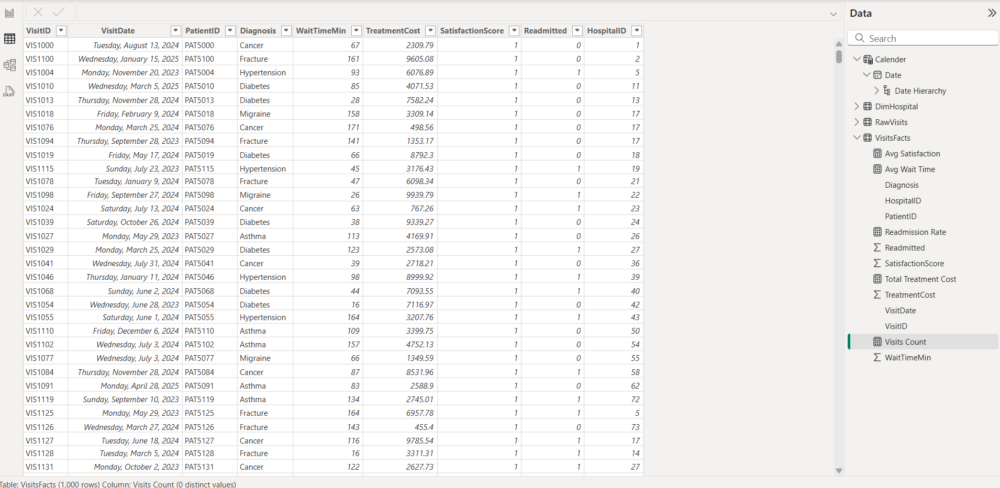
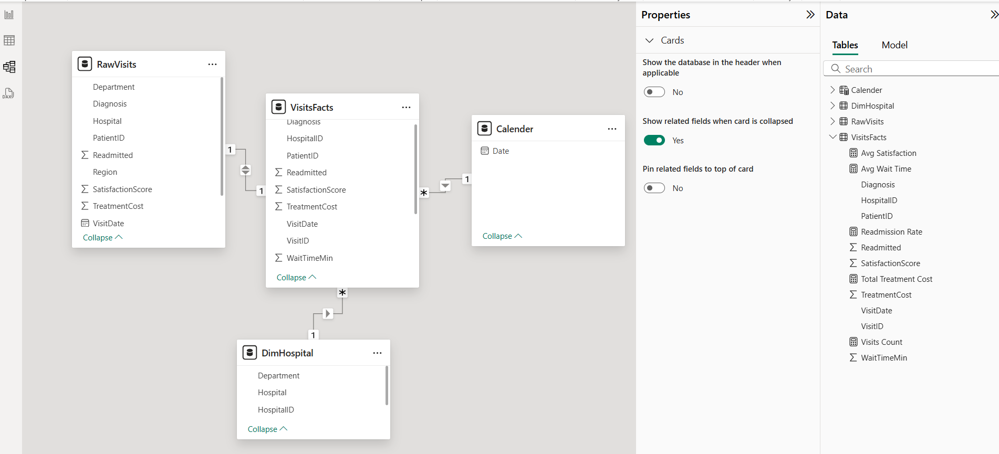

## Overview
This project analyzes patient visit patterns across healthcare facilities to uncover key insights and support data-driven decision-making in the healthcare sector. One major challenge facing healthcare institutions is the lack of centralized, visual, and easily accessible reporting to monitor facility usage, patient demographics, and visit trends over time. This report aims to solve that by transforming raw patient visit data into a clear and actionable dashboard.
Through robust data modeling, we implemented a star schema to ensure optimal performance and scalability. The dataset was cleaned, modeled, and enriched with calculated metrics (DAX) to support interactive filtering, time analysis, and KPI tracking.

## Objective
1. Monitor healthcare performance across regions and hospitals
Track patient wait times, satisfaction levels, treatment costs, and department activity to assess operational efficiency.

2. Analyze visit patterns and department load
Visualize monthly visit trends and departmental breakdowns to support better staffing and scheduling.

3. Uncover cost and satisfaction disparities
Identify which diagnoses and hospitals are driving costs and satisfaction scores for better resource planning.

## Data Acquisition
   #### metadata
  1. VisitID (PK) – Unique identifier
  2. VisitDate – Date of hospital visit
  3. PatientID – Patient identifier
  4. Hospital – Hospital name
  5. Department – Department of treatment
  6. Diagnosis – Diagnosis name
  7. Region – Hospital region
  8. WaitTimeMin – Time waited before treatment
  9. TreatmentCost – Cost incurred for treatment
  10.SatisfactionScore – Patient satisfaction (1-5)
  11.Readmitted – Whether patient was readmitted (1=yes, 0=no)    

 ## Exploratory Data Analysis(EDA) and Data Cleaning 
For full data exploration and cleaning steps, see the [Data Exploration & Cleaning Notebook](notebooks/data_exploration_cleaning.ipynb).

 ## Data Transformation(ETL)
  Data extracted, transformed and loaded into Power BI for modeling and visualiaztion.
  
 
 ## Power BI 
 ### Data Modelling
 

 Star schema with:
- VisitsFact (fact table)
- Date, Hospital (dimension tables)

 ### Report view 

 
 
## Key insights include:

- Average Wait Time: 93.61 minutes — suggests potential inefficiencies in patient flow.

- Average Satisfaction Score: 2.99 (on a scale likely from 1 to 5) — indicates room for improving patient experience.

- Total Treatment Cost: $5.03M — underscores the financial scale and importance of cost control.

- Readmission Rate: 48.6% — relatively high, pointing to potential quality of care or follow-up issues.

- Most Visited Departments: Cardiology and Orthopedics lead in patient volume.

- Cost Drivers by Diagnosis: Asthma and Cancer incur the highest total treatment costs.

- Highest Satisfaction Scores: Sunrise Hospital and Hope General are leading in patient satisfaction.

### Calculated Measures (DAX-Based)
- Average Wait Time
Avg Wait Time = AVERAGE(VisitsFacts[WaitTimeMin])

- Average Satisfaction Score
Avg Satisfaction = AVERAGE(VisitsFacts[SatisfactionScore])

- Total Treatment Cost
Total Treatment Cost = SUM(VisitsFacts[TreatmentCost])

- Readmission Rate (%)
Readmission Rate = DIVIDE(CALCULATE(COUNTROWS(VisitsFacts), VisitsFacts[Readmitted] = "Yes"), COUNTROWS(VisitsFacts)) * 100

- Visits Count by Month/Department
Created using COUNTROWS(VisitsFacts) filtered by time or department.

### Recommendations
1. Reduce wait times through workflow optimization
Target hospitals and departments with above-average wait times for process improvement and better scheduling systems.

2. Investigate readmission causes
With a 48.6% readmission rate, further analysis is needed to explore common diagnoses or gaps in post-treatment care.

3. Improve patient satisfaction
Facilities with low scores should explore root causes via surveys or interviews and implement targeted changes (e.g., staff training, clearer communication).

## Tools used:
- Power BI
- DAX for custom KPIs
- Power Query for transformation
-Python(pandas) for data manipulation

